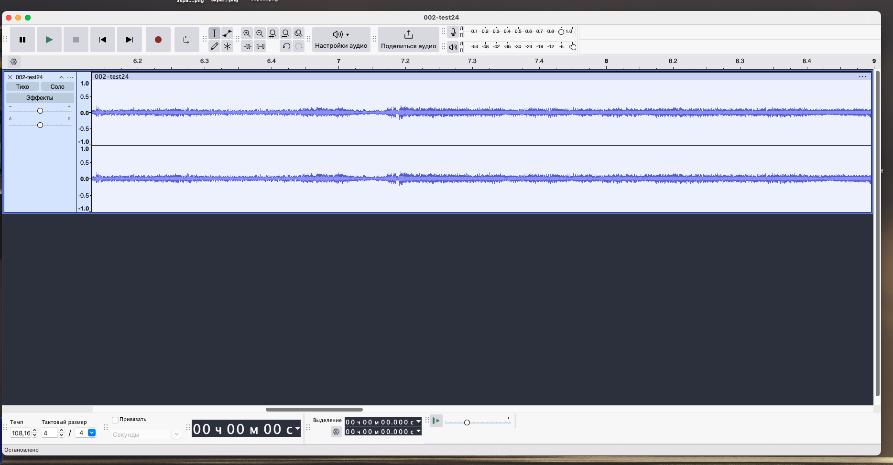

*Why is need:*

* WeAct studio Black pill stm32f411ceu6
* Any working pcm5102 shield configured as slave in i2s Phillips standard
* Any working pcm1808 shield configured as slave in i2s Phillips standard

**Big Steps for implementing**
+ make test board
+ write firmware fo stm32
+ write in/out audio  overlay for linux dts tree
+ write linux device driver for orange pi

**Wh implemented as demo**
+ simple i2s-i2s bridge firmware for stm32 (in+out) in 48k 24bit 256fs
+ opi worked as i2s master
+ stm32<->opi-mcu bridge as slave with internal clocking
+ stm32 i2s master reciever with internal clock and mclock/bclock output
+ stm32 i2s master transmitter with internal clock and mclock/bclock utput
+ clock dividers for 48/96/192K audio processing and internal i2s pll reconf +- 0.04% clock error

- simple stm32-i2s kernel audio device driver for use ALSA/JACKd (audio in and audio out)
- simple overlay for enabling i2s in Orange PI PC/ONE in 40pin GPIO header. Implement as 48k 24bit 256fs only without bclck change

* **20241031** Complete tracing shield
* **20241107** received factory printed boards

2024/Nov/08
* Received printed PCB

2024/Nov/09
* Soldered sockets anmd pins

+ ***Process Testing with STM32 board***

* Testing with simple i2s hardware-factory-slave with fs autodetection configured i2s ADC 24bit pcm1808 (board from ChipDip DAC)
command: 

  ****$arecord -t raw -D "hw:1,0" -V stereo -c 2 -f S24_LE -r 32000 -d 400 -v --dump-hw-params --disable-resample ~/002-test24.dat****

+ ***raw folder contained raw i2s 24bit 48k data and mp3 ()***
    +raw i2s data in folder ./docs/Conn_And_Tests/ADC_20241109/results/002-test24.dat
    +mp3 data in folder ./docs/Conn_And_Tests/ADC_20241109/results/002-test24.mp3
2024/Nov/17
* Added OPI SPI kernel overlay

+ Found issue with UART OPI positions

***remarks***
There was an error in placing the socket for 3PIN UART socket from orange PI to shield. This will not interfere with functionality, but will be fixed in the next version of the board.
